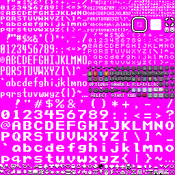

# Omelette Pixel Fonts

​Omelette Pixel Fonts is a set of monospace pixel fonts and icons. There are multiple font sizes​ (eg. large, tall, thin, thick, small, tiny), along with different visual variants (eg. plain, horizontal shadow, vertical shadow) and formats (packed texture, individual image files, PNG, GIF, BDF, SVG, TTF, CHR). Additionally, there are icon sets and button sets.



The following font glyph/icon sets are provided:

- Omelette Tiny (`om_tiny`) - 4x4 font. ASCII printable character range.
- Omelette Small (`om_small`) - 4x4 font. ASCII printable character range.
- Omelette Thin (`om_thin`) - 8x8 font. ASCII printable character range.
- Omelette Thick (`om_thick`) - 8x8 font. ASCII printable character range.
- Omelette Tall (`om_tall`) - 8x16 font. ASCII printable character range.
- Omelette Large (`om_large`) - 16x16 font. ASCII printable characters.
- Omelette Window (`om_window`) - 8x8 tileset - contains a menu window frame, window fill shape, cursor, and a couple misc icons.
- Omelette Icons (`om_icons`) - 8x8 tileset - contains a bunch of icons that could be useful for menus or HUDs.
- Omelette Buttons (`om_buttons`) - 8x8 font - contains color icons for bunch of various controller types, note that some of these require multiple tiles or require text to placed next to a generic button. This set attempts to capture various bits and pieces of many popular controller types. Manual assembly required to make these fit for an on-screen button display. No guarantee that these button faces would pass certification requirements if used in a console port.
- Omelete Complete (`om_complete`) - 256x256 texture atlas containing the above font/icon sets. Useful for a single drop-in texture containing all of the above.

The fonts that contain the ASCII printable character range also contain an ellipses character as a placeholder. Having a placeholder allows padding the font to an even 96 characters. By doing this cleanly aligns on a 16 column x 6 row wide monospace grid in when using ASCII encoding in a row-major index order starting from character 0x20 .. 0x2F as columns 0 .. 15 on row 0, 0x30 .. 0x3F on row 1, etc, until 0x70 .. 0x7F on row 2. It can be used for dialogue that wants condensed text (but may want to map to a character other than character code 127, because it has meaning as the delete character).

Within each font set there are the following variants:

- `plain` (Recommended) - Unmodified from the source glyph. Font faces contain no shadow.
- `vshadow` (Recommended) - vertical drop shadow.
- `plain_black` - Similar to `plain`, but using black as the primary color.
- `hshadow` - Horizontal drop shadow.
- `hvshadow` - Horizontal+vertical drop shadow.
- `hshadow_outline` - horizontal shadow-outline texture containing the shadow by itself. useful for drawing tinted or alpha-blended outlines.
- `vshadow_outline` - vertical shadow-outline texture containing the shadow by itself. useful for drawing tinted or alpha-blended outlines.
- `hvshadow_outline` - horizontal+vertical shadow-outline texture containing the shadow by itself. useful for drawing tinted or alpha-blended outlines.

The primary color used for the fonts is white so that either texture modulation (component-wise RGBA multiplication against a constant color) or extra shaders will work. The exception is the dark font that.

Within each icon set there are the following variants:

- `plain`: (Recommended) Unmodified from the source glyph. Icons contain an pre-drawn shadow and potentially extra colors.
- `shadow_outline`: Shadow-outline texture containing the shadow by itself. useful for drawing tinted or alpha blended outlines.
- `monochrome_shadow`: Only used by the button set. A black-and-white version with shadows included.

The following formats are currently exported:

- **GIF** (indexed)
- **BMP** (indexed, RGB with magenta background)
- **PNG** (indexed, RGB with magenta background, RGBA, RGBA in Love2D Image Font Format)
- **SVG** (packed, individual glpyhs)
- **TTF**
- **BDF**
- **CHR** (1bpp, GB-style 2bpp, NES-style 2bpp)

For indexed/paletted images, the palette reserves N colors in following order, where N is the N of total colors encountered in the image:

- `0`: background color
- `1`: black
- `2`: white
- `3 .. N - 1`: all other colors, in the order they are encountered when scanning the image left-to-right, top-to-bottom.

# Known Limitations / Scope Restrictions

This project was intentionally designed with some restrictions to its scope, as well as known limitations, caveats and drawbacks.

- **Shadows:** with the shadow variants, the shadow will always be cropped to fit within the monospace cell, (eg. fitting each glyph to an 8x8 and clipping any shadow that bleeds outside). If this is not wanted, it might be easiest to draw multiple copies on top of each other, or use a shader/filter to do outlining during rendering.
- **Monospace Only** Fonts: All fonts here are monospace and are intended to be used as such, but there is a workaround. These could potentially look okay if provided with VWF font rendering system to elide exceess whitespace. The kerning will probably be a bit off.
- **Extended Characters**: This only supports the ASCII character set. The project was intended to have all of its fonts fit in a single 256x256 texture atlas. Adding any additional characters with that in mind isn't possible because all space is used by existing fonts or icon sets. This project does not have the resources to directly maintain an extended character set for the forseeable future. However, feel free to create derivatives that will expand on the character set, mix with compatibly-licensed character sets in other languages, or replace unwanted glyphs.
- **Rich Formatting** (eg. Italics, Bold): With the exception of the thin/thick, variants at the 8x8 size there is no rich formatting.
- **Code Reusability**: The scripts are tossed together and are not meant as a general library, instead it's a slapped together set of scripts.
- **Code Quality**: Code quality and optimizations were not concerns beyond maintenance to be able to generate many formats/variants more easily. It runs fast enough to be done in about 10 seconds on my PC, but could probably run way faster if it weren't a Python script.

One design constraint for this font was to fit all glyph sets in a single 256x256 texture, which meant a fixed amount of space, so many other constraints were decided by this. Some parts like icons/button are extras but they're hopefully of use.

# Contents

- `readme.md` - this file.
- `asset_license.md` - asset license.
- `code_license.md` - code license.
- `omelette_source.png` - the original image used to generate all other images in the project
- `build.py` - does all the build scripts, one after another.
- `generate_sheets.py` - a python script for automating the font variant generation.
- `fontforge_convert_to_ttf.py` - a python script for building TTFs. requires FontForge.
- `common.py` - Some of the stuff used by both Python scripts.
- `bundle.py` - Used to bundle all the files into a .zip.
- `bundle.py` - Used to bundle all the files into a .zip.
- `test.html` - A test of the TTF fonts on a web page.
- `assets/` - a folder containing assets for multiple variants/formats of the Omelette font.
  These folders are grouped by file format.
  Generally each file in the folder follows the form `om_[tileset]_[variant]_[format].[extension]`,
  where `format` is left off if there's only one data format exported for that file extension.
  However, not everything follows this format.
  See earlier readme text to find more information about fontsets and variants, and further elaboration in the subdirectory descriptions.
- `assets/bmp_indexed/*.bmp` - Indexed BMP.
- `assets/bmp_rgb_magenta/*.bmp` - 24-bit RGB BMP with death magenta #FF00FF background.
- `assets/gif/*.gif` - GIF.
- `assets/gif_invidual/*.gif` - GIF. Individual glyph images.
- `assets/png_indexed/*.png` - Indexed PNG.
- `assets/png_rgb_magenta/*.png` - 24-bit RGB PNG with death magenta #FF00FF background.
- `assets/png_rgba/*.png` - 32-bit RGBA PNG with alpha transparency
- `assets/png_rgba_love2d/*.png` - 32-bit RGBA PNG with alpha transparency, Love2D image font format. Use like so:  
  ```
  local FONT_CHARACTER_ORDER = ' !"#$%&\'()*+,-./0123456789:;<=>?@ABCDEFGHIJKLMNOPQRSTUVWXYZ[\\]^_`abcdefghijklmnopqrstuvwxyz{|}~\x7f'
  local font = love.graphics.newImageFont('om_large_vshadow_rgba_love.png', FONT_CHARACTER_ORDER)
  ```
- `assets/png_rgba_individual/<glyphset>/*.png` - 32-bit RGBA PNG with alpha transparency. Individual glyph images.
- `assets/svg/svg_packed/*.svg` - packed SVG image containing all glpyhs.
- `assets/svg/svg_individual/<glyphset>/*.svg` - individual SVG images for each glyph in the font. The glyphs are numerically indexed by their ASCII character code (which can be used to map back to a character if needed by a script), and also have descriptive name of the character (to have path-safe case-insensitive names that aid in disambiguating in searching). The icons have a numeric identifier as. To have the same sorting on file systems, these are represented as zero-padded 3-digit representation of its decimal (base-10) integer (eg. '123' for 123, '012' for 012, '003' for 3).
- `assets/ttf/*.ttf` - TrueType Fonts.
- `assets/bdf/*.bdf` - Glyph Bitmap Distribution Format format fonts.
- `assets/chr_1bpp/*.chr` - 1bpp (2-color) CHR format, 8 bytes per glyph.
- `assets/chr_gb/*.chr` - 2bpp (4-color) CHR format in GB-style interleaved format, 16 bytes per glyph.
- `assets/chr_nes/*.chr` - 2bpp (4-color) CHR format in NES-style planar format, 16 bytes per glyph.

# Running the Scripts

```
./build.py [--force-replace]
```

Builds everything. Run this to simplify running all the other steps.

- `--force_replace` - toggles whether or not to clean the folders before generation. This will delete all contents in the folder without confirmation, so be sure to only include this flag if there are no local changes within these folders. (The default is not regenerate things if the folder already exists, in order to preserve any local files, so use this flag for easier development/iteration on the font itself.)

---

```
./generate_sheets.py [--force-replace]
```

Generates the various "sheets" or glyph and icon sets with variants in multiple formats. (NOTE: some fonts format require further steps after, or separate tools entirely. This covers the formats that can be done with easily with hand-written code or formats with decent libraries on Pip.)

REQUIRES: Python 3 (3.7.4), Pillow (7.0.0), svgwrite (1.4.2). The parenthesized numbers are the versions that were used during this script's development.

- `--force_replace` - toggles whether or not to clean the folders before generation. This will delete all contents in the folder without confirmation, so be sure to only include this flag if there are no local changes within these folders. (The default is not regenerate things if the folder already exists, in order to preserve any local files, so use this flag for easier development/iteration on the font itself.)

---

```
fontforge_convert_svg_to_ttf.py [--force-replace]
```

Create a collection of TTF files using files from the `svg_individual` and `bdf` asset folders as a source. 

REQUIRES: FontForge (582bd41a9bf04326300fc02a677fe3610d6d3ccd). The parenthesized number is the tested version.

- `--force_replace` - toggles whether or not to clean the folders before generation. This will delete all contents in the folder without confirmation, so be sure to only include this flag if there are no local changes within these folders.

---

```
bundle.py
```

Create a zip distribution of the font. Packs all surrounding files and folders into a zip, excluding files that are named in `.gitignore`.


# License

The font assets are licensed under a Creative Commons Attribution 4.0 International License (CC BY 4.0): See https://creativecommons.org/licenses/by/4.0/ or `asset_license.md` included with this repository.

The code used to generate the assets is licensed under an MIT license, see `code_license.md`.

# Contributing

This project is released as-is, with no gurantee of future maintenance beyond what is here, but work may continue for corrections/revisions. This project may be forked in accordance with the above license terms. You can also report issues or suggest improvements, but please respect that I might not apply these. However, you're always welcome to create a fork, or use these tools in your own font projects, provided you respect the licensing of this project. I tried to provide a bunch of formats for multiple use cases. I hadn't quite tested this font extensively yet, and it might need further fixes. Hopefully what's there is useful or at least motivates more people to make better pixel fonts.

Thanks, hope you enjoy these fonts!